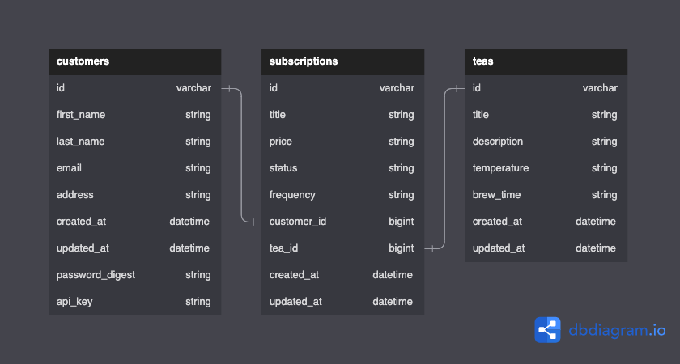

# README

<!-- PROJECT SHIELDS -->
<!--
*** I'm using markdown "reference style" links for readability.
*** Reference links are enclosed in brackets [ ] instead of parentheses ( ).
*** See the bottom of this document for the declaration of the reference variables
*** for contributors-url, forks-url, etc. This is an optional, concise syntax you may use.
*** https://www.markdownguide.org/basic-syntax/#reference-style-links
[![MIT License][license-shield]][license-url]
[![LinkedIn][linkedin-shield]][linkedin-url]
[![Stargazers][stars-shield]][stars-url]
-->
<!-- PROJECT LOGO -->
<br />
<div align="center">

[![Contributors][contributors-shield]][contributors-url] [![Forks][forks-shield]][forks-url] [![Issues][issues-shield]][issues-url]

<a href="https://github.com/josephhilby/tea_subscription_service">

## The Tea Store API

</a>

<h3 align="center">
<br />
<a href="https://github.com/josephhilby/tea_subscription_service/issues">Report Bug</a>
·
<a href="https://github.com/josephhilby/tea_subscription_service/issues">Request Feature</a>
</h3>
</div>

<!-- TABLE OF CONTENTS -->

<details>
<summary>Table of Contents</summary>
<ol>
<li><a href="#about-the-project">About The Project</a></li>
<li><a href="#getting-started">Getting Started</a></li>
<li><a href="#api-endpoints">API Endpoints</a></li>
<li><a href="#roadmap">Roadmap</a></li>
<li><a href="#contact">Contact</a></li>
<li><a href="#contributing">Contributing</a></li>
<li><a href="#acknowledgments">Acknowledgments</a></li>
</ol>
</details>

<!-- ABOUT THE PROJECT -->

## About The Project

This project was a take home tech challenge to create a ***Ruby on Rails*** API from the provided [document](https://mod4.turing.edu/projects/take_home/take_home_be).

<p align="right">(<a href="#README">back to top</a>)</p>

<!-- GETTING STARTED -->

## Getting Started

### Local Installation

This application was made with the following:

* ruby 2.7.4

* rails 6.1.7

To install and run on your personal computer you will need to do the following:

1. Fork and clone the repo to your local machine.

2. Install gems and create database.

```sh
bundle install
rails db:{drop,create,migrate,seed}
```

<br />
<table border="0">
<tr>
<th><b style="font-size:30px">DB Diagram</b></th>
</tr>
<td></td>
</tr>
</table>

3. Start your rails server in the root directory.

```sh
rails s
```

4. Now all you need to do is make a request to one of the endpoints. Documentation for all API Endpoints can be found below.

<p align="right">(<a href="#README">back to top</a>)</p>

<!-- ENDPOINTS -->

## API Endpoints

### GET

<details>
<summary> <code>localhost:3000/api/v1/subscriptions?api_key=your_key_here</code> </summary>

>Get a list of or single (`api/v1/subscriptions/:id`) subscription(s) for a given customer.
>
>**200 OK Response**
>
> ```
>{
>   "data": [
>       {
>           "id": "1",
>           "type": "subscription",
>           "attributes": {
>               "title": "Essential",
>               "price": "6.93",
>               "status": "Active",
>               "frequency": "Weekly"
>           },
>           "relationships": {
>               "customer": {
>                   "data": {
>                       "id": "1",
>                       "type": "customer"
>                   }
>               },
>               "tea": {
>                   "data": {
>                       "id": "1",
>                       "type": "tea"
>                   }
>               }
>           }
>       },
>       {...}
>   ]
>}
> ```

</details>

### POST

<details>
<summary> <code>localhost:3000/api/v1/subscriptions?api_key=your_key_here</code> </summary>

>Create a single subscription for a given customer.
>
>**Parameters (JSON payload in request body)**
>
>```
>{
>   "subscription": {
>       "status": "status",
>       "frequency": "frequency",
>       "customer_id": 1,
>       "tea_id": 1
>   }
>}
>```
>
>**201 CREATED Response**
>
>```
>{
>   "message": "Subscription added successfully"
>}
>```

</details>

### PATCH

<details>
<summary> <code>localhost:3000/api/v1/subscriptions/:id?api_key=your_key_here</code> </summary>

>Update a single subscription for a given customer.
>
>**Parameters (JSON payload in request body)**
>
>```
>{
>   "subscription": {
>       "title": "New Title"
>   }
>}
>```
>
>**200 OK Response**
>
>```
>{
>   "data": {
>       "id": "7",
>       "type": "subscription",
>       "attributes": {
>           "title": "New Title",
>           "price": "price",
>           "status": "status",
>           "frequency": "frequency"
>       },
>       "relationships": {
>           "customer": {
>               "data": {
>                   "id": "1",
>                   "type": "customer"
>               }
>           },
>           "tea": {
>               "data": {
>                   "id": "1",
>                   "type": "tea"
>               }
>           }
>       }
>   }
>}
>```

</details>

### DELETE

<details>
<summary> <code>localhost:3000/api/v1/subscriptions/:id?api_key=your_key_here</code> </summary>

>Destroy a single subscription for a given customer.
>
>**204 NO CONTENT Response**
>

</details>


<p align="right">(<a href="#README">back to top</a>)</p>

<!-- ROADMAP -->

## Roadmap

Main Goal(s)

* [x] GET `/subscriptions` Endpoint
* [x] CREATE `/subscriptions/:id` Endpoint
* [x] DELETE `/subscriptions/:id` Endpoint

Stretch Goals

* [x] UPDATE `/subscriptions/:id` Endpoint
* [x] GET `/subscriptions/:id` Endpoint
* [x] Add prams check and error handeling
* [x] Implement basic authentication with bcrypt
* [x] Implement api_token

Super Stretch Goals

* [ ] Setup GitHub Actions
* [ ] Update docs with Swagger

See the [open issues](https://github.com/josephhilby/tea_subscription_service/issues) for a full list of proposed features (and known issues).

<p align="right">(<a href="#README">back to top</a>)</p>


<!-- CONTACT -->

## Contact

<div align="center">
<table>
<tr>
<td></td>
</tr>
<tr>
<td>Joseph Hilby</td>
</tr>
<tr>
<td>
<a href="https://github.com/josephhilby">GitHub</a><br>
<a href="https://www.linkedin.com/in/josephmhilby/">LinkedIn</a>
</td>
</tr>
</table>
</div>

<p align="right">(<a href="#README">back to top</a>)</p>

<!-- CONTRIBUTING -->

## Contributing

Do you have a better & cooler way of doing what I did? Your contribution would be **greatly appreciated**.

Please fork the repo, create your branch, and create a pull request. You can also simply open an issue with the tag "enhancement".

1. Fork the Project
2. Create your Feature Branch (`git checkout -b feature/AmazingFeature`)
3. Commit your Changes (`git commit -m 'Add some AmazingFeature'`)
4. Push to the Branch (`git push origin feature/AmazingFeature`)
5. Open a Pull Request

Thanks again!

<p align="right">(<a href="#README">back to top</a>)</p>

<!-- ACKNOWLEDGMENTS -->

## Acknowledgments

* [Turing School of Software Design](https://turing.edu/)
* [DBdiagram.io](https://dbdiagram.io/home)
* [Best-README-Template](https://github.com/othneildrew/Best-README-Template)
* [API-endpoints](https://github.com/bufferapp/README/blob/master/billing/api-endpoints.md)

<p align="right">(<a href="#README">back to top</a>)</p>

<!-- MARKDOWN LINKS & IMAGES -->

<!-- https://www.markdownguide.org/basic-syntax/#reference-style-links -->

[contributors-shield]: https://img.shields.io/github/contributors/josephhilby/tea_subscription_service.svg?style=for-the-badge

[contributors-url]: https://github.com/josephhilby/tea_subscription_service/graphs/contributors

[forks-shield]: https://img.shields.io/github/forks/josephhilby/tea_subscription_service.svg?style=for-the-badge

[forks-url]: https://github.com/othneildrew/josephhilby/tea_subscription_service/network/members

[issues-shield]: https://img.shields.io/github/issues/josephhilby/tea_subscription_service.svg?style=for-the-badge

[issues-url]: https://github.com/josephhilby/tea_subscription_service/issues
